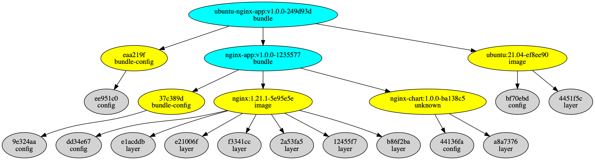

## TL; DR

oci-bundle将**数据包与镜像（统称为制品）bundle起来**，用于离线交付

- image使用docker上传至oci distribution中
- 数据包使用oras/cb上传至oci distrbution中
- bundle将这些制品通过oci index结构关联起来，通过`bundle.yaml`声明组织关系，支持嵌套声明

## Demo

实验环境可使用[docker registry](https://hub.docker.com/_/registry) 搭建，指定域名为`myregistry`，监听端口为5000

#### bundle构建索引

```shell
# 上传数据包
cb push myregistry:5000/nginx-chart:1.0.0 --files examples/mychart

# 上传镜像
docker pull nginx:1.21.1
docker tag nginx:1.21.1 myregistry:5000/nginx:1.21.1
docker push myregistry:5000/nginx:1.21.1

# 查看registry的repository
cb catalog myregistry:5000

# 打包
cb bundle examples/nginx-bundle.yaml
# 查看nginx-app:v1.0.0对应的desc（index 类型）
cb manifest myregistry:5000/nginx-app:v1.0.0
```

#### 打包下载

```
cb pack myregistry:5000/nginx-app:v1.0.0 -o nginx-app
```

包结构为[OCI image layout](https://github.com/opencontainers/image-spec/blob/main/image-layout.md)

#### 加载过程

```shell
# 将myregistry数据清理掉（模拟离线registry）
cb load nginx-app
```

#### 补丁机制

```shell
# 上传ubuntu镜像
docker pull ubuntu:21.04
docker tag ubuntu:21.04 myregistry:5000/ubuntu:21.04
docker push myregistry:5000/ubuntu:21.04

# bundle ubuntu-nginx索引
cb bundle examples/ubuntu-nginx-app.yaml

# 生成补丁
cb diff myregistry:5000/ubuntu-nginx-app:v1.0.0 myregistry:5000/nginx-app:v1.0.0 -o oci-patch

# 加载补丁（清空myregistry，加载nginx-app，不上传ubuntu镜像）
cb patch oci-patch

# 查看nginx-ubuntu-app:v1.0.0索引
cb manifest myregistry:5000/ubuntu-nginx-app:v1.0.0
```

#### 查看oci blob tree

```
cb plot myregistry:5000/ubuntu-nginx-app:v1.0.0 -o graph.dot
dot -T png graph.dot > graph.png
```



## 说明

- 此工具进行离线交付的前提是离线环境与公司内环境的registry endpoint相同（相同域名及服务监听端口），`index.json`中已将source registry endpoint写死
- 部分oci distribution对oci artifacts机制支持不好，比如**nexus不支持index mediaType，且layer mediaType仅支持tar/gz格式**
- 项目中使用oras库较为stale，v1+提供了更友好的copy lib
- cb工具可以通过`make`编译，路径为项目下bin/cb，更多用法可通过`cb -h`获取

## Blog

- https://www.raygecao.cn/posts/oras/
